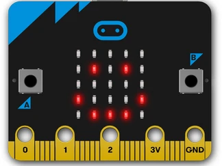

# Microbit

Vad är en Microbit? Ett litet kretskort med en massa sensorer och en display.
* https://microbit.org/get-started/what-is-the-microbit/#computing-made-physical

Koda i webbläsaren (där finns en emulator)!
Du kan skriva kod i block, i javascript eller i python.
* https://makecode.microbit.org/

Har du aldrig kodat förut, gör ett blinkande hjärta!
Vill du prova annat, hitta en guide och följ den.

De flesta programmen har någon form av loop, som gör att programmet körs om och om igen. Det kan vara det block som heter `forever`, som gör att loopen körs för alltid. Eller så kan det vara en `while` loop som körs så länge ett villkor är sant. Eller så kan det vara en `for` loop som körs ett visst antal gånger.

Ofta så startas koden från någon form av input. Microbit hanterar ett antal olika input, som knappar, sensorer, bluetooth, radio, etc. Det finns block för att hantera dessa.

Så testa någon form av input och låt Microbiten reagera på detta. Microbiten kan då visa grafik på sin display, spela ljud, styra något annat, etc.

# Webb

Klona det här repot.
* Logga in på github.
* Gå till https://github.com/jensadev/bussdagen
* Klicka på knappen `Code` och kopiera länken.
* Klona projektet med Visual studio code.
  * Öppna Visual studio code.
  * Klicka på `Source Control` (den med en git ikon).
  * Klicka på `Clone Repository`.
  * Klistra in länken.
  * Välj en mapp att spara i.

Jobba med `index.html`, `style.css` och `script.js`.

Titta på sidan i webbläsaren med `Live server` extension. Installera och klicka på `Go Live` i statusbaren.

I index finns det en grundläggande layout, en knapp och en bild.
* Byt bild, lägg in en ny i `images` mappen och ändra sökvägen i index.
* Ändra texten på webbsidan.
* Ändra stilerna.
* Byt till ett annat typsnitt från google fonts, lägg in den i `index.html` och ändra i `style.css`.
  * https://fonts.google.com/
* Lägg till en knapp till, testa att ändra funktionen i `script.js`.